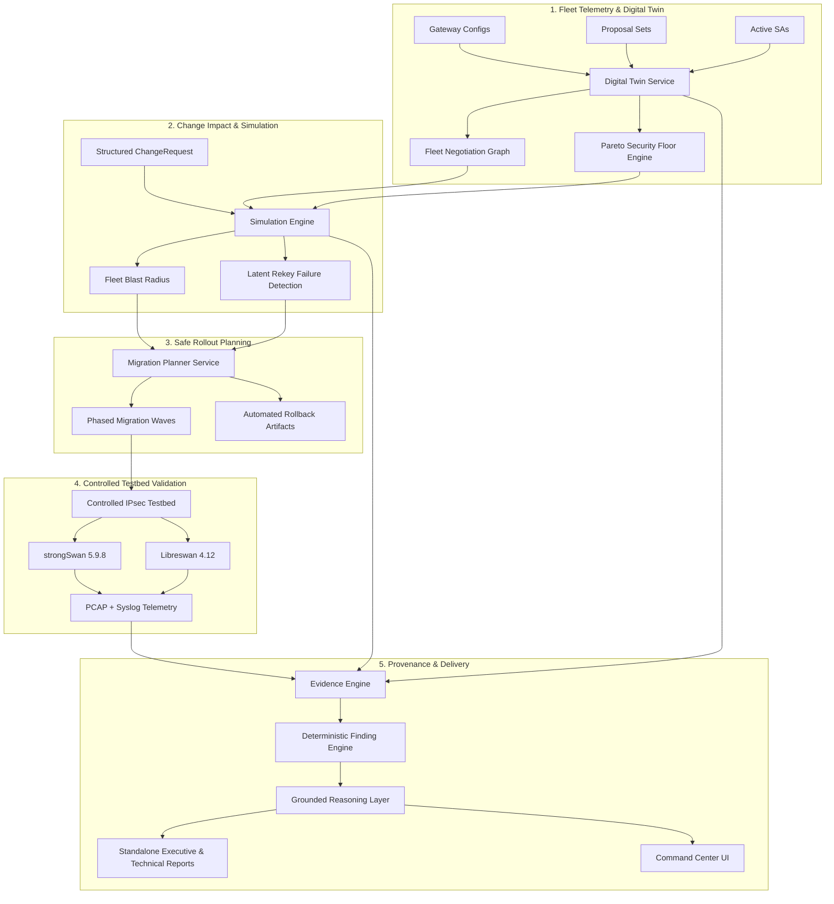

# STATEFLUX

## IPsec Security Change-Impact Intelligence

> **Know what happens before you change the VPN.**

Traditional IPsec security assessment primarily answers whether a VPN is secure in its current state. STATEFLUX models what happens when that state changes — across a connected VPN fleet — before the change is deployed.

```text
CURRENT STATE
      ↓
SECURITY FLOOR
      ↓
CHANGE
      ↓
FUTURE-STATE SIMULATION
      ↓
BLAST RADIUS
      ↓
MIGRATION PLAN
      ↓
REAL IPsec LAB
      ↓
PREDICTION vs REALITY
      ↓
EVIDENCE
```

---

## STATEFLUX in 60 Seconds

1. **Model the VPN as a fleet, not isolated tunnels:** Maps gateway endpoints and cryptographic connections as an interconnected topological graph.
2. **Identify the selected security AND the weakest permitted security floor:** Measures the downgrade frontier rather than only celebrating the currently active cipher.
3. **Simulate a cryptographic policy change before deployment:** Ingests structured change requests and computes future compatibility without live traffic disruption.
4. **Calculate the fleet-wide blast radius:** Classifies every tunnel deterministically into `HARDENED`, `UNCHANGED`, `DEGRADED`, `INCOMPATIBLE`, `LATENT_FAILURE`, or `UNKNOWN`.
5. **Detect tunnels that can fail only at the next rekey:** Flags dormant configuration defects where existing Security Associations remain active but collapse hours later during `CREATE_CHILD_SA`.
6. **Generate a migration order with blockers and rollback:** Sequences rollouts by topological centrality (Canary → Regional → Core) with pre-flight checks and automated inverse rollback artifacts.
7. **Validate the prediction against a real controlled IPsec testbed:** Compares simulated outcomes against production **strongSwan 5.9.8** and **Libreswan 4.12** daemons (**5/5 controlled testbed scenarios matched**).
8. **Trace findings back to logs, PCAP, and configuration evidence:** Enforces an unbroken provenance ledger linking every severity score directly to verified artifacts.

---

## Why STATEFLUX?

STATEFLUX is not just an IPsec scanner, configuration checker, or dashboard.

It is a **security change-impact intelligence platform** that models how cryptographic policy changes propagate through a VPN fleet, identifies compatibility and latent-rekey failures before deployment, generates a staged migration plan, and validates the predicted behavior against a controlled real IPsec testbed.

In enterprise network security, cryptographic posture and operational uptime are frequently in direct tension:
- Upgrading cryptographic policies is necessary to meet modern standards (NSA CNSA, NIST SP 800-77r1).
- But executing a policy update across heterogeneous gateways (Cisco, Fortinet, Juniper, strongSwan, Libreswan) risks catastrophic outages.
- Existing tools scan configurations at rest or monitor active tunnels. Neither answers what happens **during** or **after** a fleet-wide policy transition.

STATEFLUX closes this gap by transforming static configuration audits into predictive change intelligence.

---

## What Makes STATEFLUX Different

| Capability | Conventional Assessment | STATEFLUX |
| :--- | :--- | :--- |
| **Current-State Assessment** | *"What is configured right now?"* Inspects static configuration text files or active MIBs. | *"What is configured now, what is actually negotiable, and what is the weakest permitted security floor?"* Computes the full negotiation space and downgrade frontier. |
| **Single Tunnel vs Fleet** | Evaluates individual tunnels in isolation. Misses shared gateway dependencies. | Models the entire VPN network as an interconnected **Fleet Negotiation Graph** of endpoints, tunnels, and shared cryptographic profiles. |
| **Change Impact** | Reports current vulnerabilities and leaves change consequences to guesswork. | Ingests a structured `ChangeRequest` and deterministically calculates future-state compatibility and fleet **blast radius** prior to deployment. |
| **Weak Fallback Analysis** | Flags weak ciphers in configuration files without determining if they can negotiate. | Distinguishes the **selected active suite** from the **weakest permitted fallback floor**, computing the multidimensional Pareto floor gap. |
| **Latent Failure Detection** | Assumes that if a tunnel is currently `UP`, the configuration is valid. | Exposes **Latent Rekey Failures**: tunnels that remain UP immediately after a policy update but are guaranteed to drop at the next RFC 7296 Child-SA rekey. |
| **Migration Intelligence** | Provides generic remediation checklists or advice. | Synthesizes an automated **Staged Migration Plan** with canary waves, dependency ordering, migration blockers, and automated inverse rollback artifacts. |
| **Reality Validation** | Assessment ends with theoretical analysis or scoring. | Executes predictions in an isolated **controlled strongSwan & Libreswan lab**, empirically verifying predictions against real daemon negotiation outcomes. |
| **Evidence Provenance** | Findings, syslog files, and PCAP captures exist in disjoint silos. | Maintains an **Unbroken Evidence Chain** with strict provenance categories (`OBSERVED`, `DERIVED`, `SIMULATED`, `PREDICTED`, `UNKNOWN`). |
| **Grounded AI Reasoning** | Generative LLMs hallucinate ciphers, CVEs, or compliance states. | The **deterministic engine remains authoritative**; the reasoning layer strictly explains verified evidence and explicitly preserves unknown states. |

---

## The Core Idea: Security Change Impact

The core concept behind STATEFLUX is simple but transformative:

```text
CURRENT
   ↓
CHANGE
   ↓
AFTER
```

Expanded across an enterprise infrastructure:

```text
Current Digital Twin        --> Canonical data model of endpoints, proposals, and active agreements
       ↓
Fleet Negotiation Graph     --> Topological graph mapping shared dependencies and centrality
       ↓
Security Floor              --> Pareto frontier of the weakest allowable fallback suites
       ↓
Change Request              --> Structured cryptographic policy directives (prohibit, require, min DH)
       ↓
Future-State Simulation     --> Deterministic recalculation of proposal intersections per tunnel
       ↓
Blast Radius                --> Quantification of Hardened, Incompatible, and Latent Failure tunnels
       ↓
Migration Waves             --> Topological rollout staging (Canary → Regional → Core) with rollbacks
       ↓
Real IPsec Validation       --> Empirical testbed execution verifying predictions against real daemons
```

---

## Security Floor — Not Just the Selected Cipher

A VPN tunnel can be negotiated using a strong selected proposal while still permitting weaker alternatives.

```text
SELECTED SECURITY
        vs
PERMITTED SECURITY FLOOR
```

Consider an operational IPsec tunnel connecting a regional branch to a corporate datacenter:

```text
Selected Suite:    AES-256-GCM / SHA-384 / DH Group 20 / PFS Active
Permitted Floor:   3DES-CBC    / SHA-1   / DH Group 2  / PFS Disabled
```

Traditional tools observe that the active tunnel is running `AES-256-GCM` and report the connection as fully secure. 

STATEFLUX recognizes that this tunnel suffers from a critical **Security Floor Gap**. If an active adversary forces a renegotiation or issues an unauthenticated `INVALID_KE_PAYLOAD`, the endpoints can silently fall back to `3DES` and `DH Group 2`. 

STATEFLUX models the security floor as a **multidimensional Pareto frontier** (evaluating Encryption, PRF, Integrity, Diffie-Hellman, and Forward Secrecy) rather than an arbitrary scalar score.

---

## From Individual Tunnels to a Fleet-Level Security Graph

Enterprise IPsec deployments are not collections of independent point-to-point links. They are interconnected systems:

```text
Nodes = VPN Gateway Endpoints
Edges = IPsec Security Associations & Tunnels
```

A policy change applied to a central hub gateway directly impacts dozens of remote branches, cloud connectors, and third-party partner gateways.

```text
[ Core Hub DC ] ──(tn-001)──> [ Branch Gateway A ]
       │
       ├──(tn-002)──> [ Branch Gateway B ]
       │
       └──(tn-003)──> [ Cloud Transit VPC ]
```

Treating tunnels in isolation causes operators to overlook:
- **Shared Gateway Dependencies:** Changing an endpoint's proposal configuration alters the negotiation space for every tunnel terminating on that device.
- **Topological Centrality:** High-degree hub gateways carry exponential blast radius compared to edge branch routers.
- **Rollout Ordering:** Upgrading an initiator before a responder causes immediate connection failure, whereas upgrading the responder first with backward-compatible offers enables zero-downtime cutovers.

STATEFLUX calculates impact across the entire connected fleet graph.

---

## The Failure Mode STATEFLUX Can Expose Before Deployment

### The Latent Rekey Failure Lifecycle

The most dangerous operational failure mode in IPsec is not an immediate negotiation error. It is a **Latent Rekey Failure**:

```text
Tunnel UP
   ↓
Policy appears operational
   ↓
Weak proposal removed from responder
   ↓
Current Security Association remains active and passing traffic
   ↓
Lifetime timer expires (e.g. 1 hour to 8 hours later)
   ↓
Initiator triggers RFC 7296 CREATE_CHILD_SA offering configured suite
   ↓
Responder rejects offer under newly active policy
   ↓
NO_PROPOSAL_CHOSEN
   ↓
Existing SA deleted without replacement
   ↓
LATENT FAILURE — Production Outage
```

In this scenario, network administrators apply a policy update, verify that all tunnels remain `UP`, declare maintenance successful, and sign off. Hours later, in the middle of production traffic, tunnels abruptly disconnect when cryptographic rekeying triggers.

### Controlled Testbed Validation (LAB-05)

STATEFLUX predicted this exact failure mode and empirically verified it in a controlled strongSwan 5.9.8 to Libreswan 4.12 testbed:

```text
Scenario:       LAB-05 (Latent Rekey Failure)
Predicted:      LATENT_FAILURE
Actual:         LATENT_FAILURE (CHILD_SA rekey rejected with NO_PROPOSAL_CHOSEN at 00:30.030)
Agreement:      PREDICTION = OBSERVATION
```

Across all empirical evaluation scenarios, **5/5 controlled testbed scenarios matched**.

---

## Why a Traditional Configuration Check Can Miss the Real Risk

### Scenario: Retiring Legacy 3DES Across the Fleet

Consider an enterprise policy update intended to eliminate legacy `3DES` ciphers:

```text
Current State:
- Tunnel tn-005 is active and running AES-256-GCM.
- Responder allows fallback to 3DES-CBC for legacy branch compatibility.

Basic Security Scanner Verdict:
✓ COMPLIANT: Active cipher is AES-256-GCM. Zero immediate alerts.
```

### What STATEFLUX Uncovers:

```text
1. Floor Analysis:
   - Tunnel tn-005 has a Critical Floor Gap: allows fallback to 3DES / DH 2.

2. Change Simulation (Directive: Prohibit 3DES fleet-wide):
   - Future State: 11 tunnels HARDENED.
   - Immediate Outage: 7 tunnels INCOMPATIBLE (remote peers only support 3DES).
   - Delayed Outage: 3 tunnels LATENT_FAILURE (peers negotiate fallback during Child-SA rekey).

3. Migration Intelligence:
   - Identifies 7 blocked tunnels requiring remote template updates prior to migration.
   - Generates 3 phased waves: Canary (4 tunnels) → Regional (18 tunnels) → Core (18 tunnels).
   - Generates exact inverse rollback configurations per gateway.

4. Empirical Lab Verification:
   - Controlled lab run confirms NO_PROPOSAL_CHOSEN on rekey attempt.
```

> **A configuration snapshot describes the present. STATEFLUX models the consequences of a change.**

---

## Change Simulation & Fleet Blast Radius

STATEFLUX ingests a structured `ChangeRequest` detailing policy changes (ciphers to remove, algorithms to mandate, minimum Diffie-Hellman groups, PFS requirements, IKE version constraints) and deterministically classifies every tunnel into six mutually exclusive states:

```text
┌─────────────────┐  Tunnels that successfully negotiate a stronger proposal without
│    HARDENED     │  introducing operational failure.
└─────────────────┘
┌─────────────────┐  Tunnels whose negotiated state and floor are already at or above
│    UNCHANGED    │  the target policy requirement.
└─────────────────┘
┌─────────────────┐  Tunnels that remain functional but negotiate a weaker alternative
│    DEGRADED     │  due to asymmetric policy constraints.
└─────────────────┘
┌─────────────────┐  Tunnels where the common proposal intersection becomes empty,
│  INCOMPATIBLE   │  resulting in immediate negotiation failure upon deployment.
└─────────────────┘
┌─────────────────┐  Tunnels that appear functional upon initial application but drop
│ LATENT_FAILURE  │  catastrophically during subsequent CREATE_CHILD_SA rekeying.
└─────────────────┘
┌─────────────────┐  Tunnels with unobserved negotiation parameters where deterministic
│     UNKNOWN     │  consequences cannot be mathematically guaranteed.
└─────────────────┘
```

The resulting **Blast Radius** details directly affected endpoints, indirect dependencies, and failure distributions across the network topology.

---

## Migration Intelligence: From "This Change Is Dangerous" to "Here Is How to Roll It Out"

Identifying that a security policy change will cause outages is only half the solution. Network operations teams require an actionable, safe path forward.

STATEFLUX automatically synthesizes a phased rollout sequence:

```text
CANARY WAVE (Low centrality, isolated branch tunnels)
      ↓ Verify rekey stability over 2 full cycles
LOW-CENTRALITY REGIONAL BATCH (Regional spokes and access links)
      ↓ Telemetry streaming verified
DEPENDENCY-ORDERED MIGRATION (Ordered by gateway dependencies)
      ↓ Preconditions confirmed
CORE / HIGH-CENTRALITY WAVE (Datacenter hub meshes)
```

Each wave includes:
- **Preconditions:** Health checks and remote configuration updates that must be deployed before the wave can execute.
- **Blocked Tunnels:** Explicit identification of incompatible links that will fail unless remediated beforehand.
- **Stability Criteria:** Automated verification that tunnels have completed multiple rekey cycles without drops.
- **Inverse Rollback Artifacts:** Exact pre-computed inverse configurations generated per gateway endpoint, ready for instant reversion if anomalies occur.

---

## We Don't Stop at Simulation: Controlled Real-IPsec Testbed

STATEFLUX does not rely solely on abstract algorithmic models. All predictions are validated against an empirical testbed executing production IPsec daemons in containerized Linux network namespaces:

```text
PREDICT  ──>  SIMULATE  ──>  RUN CONTROLLED TESTBED  ──>  OBSERVE  ──>  COMPARE
```

### Testbed Environment:
- **Operating Daemons:** strongSwan 5.9.8 (`charon`), Libreswan 4.12 (`pluto`)
- **Networking:** Linux Network Namespaces (`netns`), virtual veth interconnects, MTU 1500, UDP 500/4500 routing
- **Telemetry:** Syslog telemetry captured at debug loglevels; promiscuous `tcpdump` PCAP captures

### Five Controlled Validation Scenarios:

```text
┌─────────┬──────────────────────────────────┬─────────────────┬─────────────────┬────────┐
│ Scenario│ Description                      │ Predicted       │ Observed        │ Match  │
├─────────┼──────────────────────────────────┼─────────────────┼─────────────────┼────────┤
│ LAB-01  │ Secure Suite-B Baseline          │ ESTABLISHED     │ ESTABLISHED     │  YES   │
│ LAB-02  │ Weak Functional Fallback         │ ESTABLISHED     │ ESTABLISHED     │  YES   │
│ LAB-03  │ Encryption Incompatibility       │ FAILED          │ FAILED          │  YES   │
│ LAB-04  │ Diffie-Hellman Mismatch          │ FAILED          │ FAILED          │  YES   │
│ LAB-05  │ Latent Rekey Failure             │ LATENT_FAILURE  │ LATENT_FAILURE  │  YES   │
└─────────┴──────────────────────────────────┴─────────────────┴─────────────────┴────────┘
```

**Validation Result:** **5/5 controlled testbed scenarios matched.**

*(Note: Controlled testbed validation confirms prediction agreement in isolated container environments under RFC 7296/4303 semantics. It does not constitute a statistical estimate of arbitrary third-party production deployments.)*

---

## Every Finding Has a Traceable Evidence Path

In enterprise security audits, assertions must be backed by immutable provenance. STATEFLUX maintains an unbroken evidence chain connecting raw configuration inputs to verified findings:

```text
Configuration  ──>  Negotiation  ──>  Simulation  ──>  Lab Log  ──>  PCAP  ──>  Finding
  (E-001)             (E-005)           (E-008)         (E-013)     (E-014)   (F-LATENT-05)
```

### Evidence Provenance Categories:

Every recorded fact is tagged with an explicit provenance level to distinguish observed reality from inference:
- **`OBSERVED`:** Directly captured from live packet captures, syslog records, or kernel XFRM states.
- **`DERIVED`:** Deterministically computed from observed data (e.g. Pareto floor frontiers, gap ranks).
- **`SIMULATED`:** Output of the what-if simulation engine under a prospective `ChangeRequest`.
- **`PREDICTED`:** Forecasted operational outcomes (e.g. time-to-failure calculations).
- **`UNKNOWN`:** Explicitly identified visibility gaps where data is insufficient.

---

## AI That Explains — Not AI That Invents

STATEFLUX integrates artificial intelligence for contextual synthesis and natural-language explanation, with strict architectural guardrails:

> **The deterministic security engine remains the sole authority for security facts.**

```text
Deterministic Security Engine
              ↓
  Cryptographic Evidence Store
              ↓
    Verifiable Finding
              ↓
   Grounded Reasoning Layer
              ↓
  Auditable Technical Report
```

### Guardrails Enforced in Code:
- **Zero Hallucination of Security Facts:** The reasoning layer cannot invent ciphers, alter severity rankings, modify blast radius numbers, or create findings.
- **Strict Evidence Grounding:** Every generated summary references specific evidence IDs (`ev-cfg-*`, `ev-sim-*`, `ev-lab-*`).
- **Preservation of Unknowns:** If telemetry is missing, the AI preserves the `UNKNOWN` state rather than guessing.
- **Provider Architecture:** Powered by a deterministic local reasoning engine. It does not transmit sensitive network configurations to external cloud APIs.

---

## Technical Differentiation Stack

```text
LEVEL 7 │ Evidence-Grounded Explanation (Contextual synthesis anchored to immutable facts)
LEVEL 6 │ Real IPsec Validation (Empirical verification in strongSwan & Libreswan testbeds)
LEVEL 5 │ Migration Intelligence (Canary sequencing, dependency ordering, rollback synthesis)
LEVEL 4 │ Fleet Change-Impact Simulation (What-if modeling, blast radius, latent rekey failures)
LEVEL 3 │ Security-Floor Analysis (Multidimensional Pareto frontiers and downgrade gaps)
LEVEL 2 │ Negotiation Intelligence (Common negotiation space and compatibility matrices)
LEVEL 1 │ Current-State Assessment (Endpoint inventory, configuration parsing, rule evaluation)
```

Conventional VPN auditing tools operate almost entirely at **Level 1** (and occasionally Level 2). STATEFLUX integrates **Levels 1 through 7** into a unified, continuous workflow.

---

## System Architecture



---

## What Is Actually Implemented vs Deliberately Not Claimed

To maintain technical credibility, STATEFLUX clearly distinguishes implemented capabilities from deliberate out-of-scope boundaries:

### Fully Implemented & Tested
- [x] Multi-vendor canonical IPsec data models (Pydantic v2)
- [x] Fleet negotiation graph with topological degree and centrality metrics
- [x] Multidimensional Pareto security floor engine and floor gap calculation
- [x] Deterministic what-if simulation engine ingesting structured change requests
- [x] Fleet blast radius quantification (Hardened, Unchanged, Degraded, Incompatible, Latent Failure, Unknown)
- [x] Latent rekey failure classification and time-to-failure tracking
- [x] Staged migration wave sequencing (Canary, Regional, Core) with dependency resolution
- [x] Automated inverse rollback artifact generation per gateway endpoint
- [x] Containerized strongSwan 5.9.8 and Libreswan 4.12 testbed with PCAP and log parsers
- [x] End-to-end evidence ledger with explicit provenance classification
- [x] Grounded explanation layer anchored to deterministic evidence
- [x] Standalone publication-grade export engine for Executive, Technical, Change-Impact, and Lab Validation reports (HTML and native ReportLab vector PDF)
- [x] Interactive Command Center UI with 2D Canvas graph, floor inspector, and 12-step guided demo journey
- [x] 195 automated pytest unit and integration tests passing cleanly

### Deliberately Not Claimed
- **No autonomous production push:** STATEFLUX generates verified configurations and migration waves; it does not unilaterally write to production network hardware without human approval.
- **No general statistical accuracy claims:** Testbed validation proves 5/5 agreement in controlled container environments under RFC semantics. We do not claim an arbitrary statistical accuracy percentage across unknown third-party networks.
- **No unrestricted external port scanning:** Designed for managed enterprise fleet intelligence based on verified configurations and telemetry, not hostile perimeter reconnaissance.
- **No payload decryption:** Evaluates cryptographic negotiations and transform agreements; does not intercept or decrypt tunnel payload traffic.

---

## Benchmark Scale & Verified Dataset

The built-in synthetic benchmark dataset models a realistic enterprise deployment:

```text
Endpoints:             20 VPN Gateway Endpoints (Datacenter hubs, regional offices, cloud VPCs)
Tunnels:               40 IPsec Site-to-Site Tunnels
Proposals:             155 Cryptographic Proposal Sets (IKE & ESP)
Active Negotiations:   40 Negotiation Agreement Records
Observed Facts:        431 Indexed Evidence Items
Controlled Scenarios:  5 Containerized Testbed Scenarios
Automated Tests:       195 Automated Tests (100% passing)
```

---

## Technology Stack

- **Backend Framework:** Python 3.11, FastAPI, Pydantic v2, Uvicorn, Jinja2, AnyIO
- **PDF Generation:** ReportLab 5.0 (Two-pass vector PDF engine with dynamic `NumberedCanvas`)
- **Testing & Quality Assurance:** Pytest 9.1, Pytest-Asyncio, HTTPX TestClient
- **Frontend Architecture:** Vanilla JavaScript (ES2022+), CSS3 Design System, HTML5, HTML Canvas
- **IPsec Daemons (Testbed):** strongSwan 5.9.8 (`charon`), Libreswan 4.12 (`pluto`)
- **Telemetry & Packet Analysis:** `tcpdump`, standard PCAP, Python `struct` packet decoders

---

## Project Structure

```text
stateflux/
├── backend/
│   ├── app/
│   │   ├── api/routes/          # REST route handlers (fleet, security, simulation, reports)
│   │   ├── core/                # System configuration, cryptographic constants, rules
│   │   ├── models/              # Canonical Pydantic v2 domain models
│   │   ├── services/            # Core engines (floor, simulation, migration, lab, reports)
│   │   └── main.py              # Application entrypoint & lifespan data loader
│   ├── tests/                   # 195 automated unit and integration tests
│   └── requirements.txt         # Python dependencies
├── data/
│   ├── seed/                    # Seed dataset (endpoints, tunnels, proposals, negotiations)
│   └── scenarios/               # Scenario catalog
├── frontend/
│   ├── css/                     # Technical dark-mode design system & components
│   ├── js/                      # Single-page application views and graph visualizer
│   └── index.html               # Main Command Center UI shell
├── lab/
│   ├── captures/                # Empirical PCAP packet captures from lab runs
│   ├── configs/                 # swanctl & Libreswan testbed configuration templates
│   └── logs/                    # Daemon syslog traces from empirical scenarios
├── report_templates/            # Dedicated standalone HTML report templates
├── report_styles/               # Dedicated report print stylesheet (report.css)
├── docs/
│   └── reports/                 # Pre-generated sample PDF and HTML deliverables
├── scripts/
│   ├── generate_dataset.py      # Synthetic dataset generator
│   └── generate_sample_reports.py # Report generation verification utility
└── run.py                       # Local development runner
```

---

## Quick Start

### 1. Installation

```bash
# Clone the repository
git clone https://github.com/pragmaticnv/statelux.git
cd statelux

# Install dependencies
pip install -r backend/requirements.txt
```

### 2. Run Automated Test Suite

```bash
python -m pytest backend/tests
```

Expected output:
```text
======================= 195 passed, 2 warnings in 3.12s =======================
```

### 3. Launch Development Server

```bash
python run.py
```

The application will initialize on `http://127.0.0.1:8000`.

- **Command Center UI:** [http://127.0.0.1:8000/ui](http://127.0.0.1:8000/ui)
- **Interactive OpenAPI Docs:** [http://127.0.0.1:8000/docs](http://127.0.0.1:8000/docs)
- **ReDoc Documentation:** [http://127.0.0.1:8000/redoc](http://127.0.0.1:8000/redoc)

---

## 12-Step Guided Demo Flow

The Command Center UI includes a built-in guided evaluator tour covering the full change-impact lifecycle:

1. **Command Center (`#/command-center`):** Fleet health overview, posture counters, and quick metrics.
2. **Negotiation Graph (`#/graph`):** Interactive 2D Canvas topology showing gateway nodes, edge tunnels, and floor gaps.
3. **Tunnel Intelligence (`#/tunnels`):** Deep inspection of active tunnels, transforms, and endpoint pairs.
4. **Security Floors (`#/security-floors`):** Pareto frontier inspector contrasting selected suites with allowable floors.
5. **Change Simulator (`#/simulations`):** Configuration panel to define structured policy changes.
6. **Simulation Execution:** Deterministic recalculation of proposal intersections across 40 tunnels.
7. **Blast Radius Analysis (`#/change-impact`):** Breakdown of Hardened vs Incompatible vs Latent Failure links.
8. **Migration Planner (`#/migration-plans`):** Staged rollout sequence (Canary → Regional → Core) with blocker alerts.
9. **Prediction vs Reality (`#/prediction-vs-reality`):** Empirical lab comparison table showing 5/5 matched scenarios.
10. **Evidence Chain (`#/evidence`):** Provenance ledger linking configurations, syslog events, and PCAP frames.
11. **Grounded AI Reasoning (`#/ai-reasoning`):** Natural-language synthesis strictly explaining verified facts.
12. **Intelligence Reports Center (`#/reports/executive`):** Downloadable standalone vector PDFs and printable HTML audits.

---

## Standalone Report Deliverables

STATEFLUX provides a dedicated reporting pipeline completely separated from the web application UI. Generated deliverables contain zero navigation bars, sidebars, or raw JSON dumps:

| Report Deliverable | Web View Route | PDF Export Endpoint |
| :--- | :--- | :--- |
| **Executive Security Report** | `#/reports/executive` | `/api/v1/reports/export/executive/pdf` |
| **Technical IPsec Report** | `#/reports/technical` | `/api/v1/reports/export/technical/pdf` |
| **Change-Impact Assessment** | `#/reports/change-impact` | `/api/v1/reports/export/change-impact/pdf` |
| **Lab Validation Report** | `#/reports/lab-validation` | `/api/v1/reports/export/lab-validation/pdf` |

Pre-rendered sample reports are available in [`docs/reports/`](docs/reports/).

---

## Limitations & Safety Scope

- **Controlled Testbed Semantics:** Prediction validation is performed in containerized Linux network namespaces running strongSwan 5.9.8 and Libreswan 4.12 under RFC 7296 (IKEv2) and RFC 4303 (ESP) specifications. Proprietary vendor firmware bugs outside standard protocol definitions are not modeled.
- **Canary Rollouts Mandatory:** While STATEFLUX identifies latent rekey and compatibility breaks beforehand, real-world deployments must always execute through the generated canary waves to catch external stateful firewall timeouts or unmodeled middlebox interference.
- **Benchmark Data:** The default fleet dataset is synthetically generated to model realistic enterprise topologies without exposing real-world credentials or infrastructure.

---

## Maintainers & Authors

- **Repository:** [https://github.com/pragmaticnv/statelux](https://github.com/pragmaticnv/statelux)
- **Author:** Nikhil Vashishtha ([@pragmaticnv](https://github.com/pragmaticnv))
- **Email:** `nikhilvashishtha19@gmail.com`

---

> ### STATEFLUX changes the question from:
>
> **"Is my IPsec VPN secure today?"**
>
> to:
>
> **"What will happen to my VPN fleet if I change its security policy tomorrow?"**
>
> **STATEFLUX answers that question before the change reaches production.**
